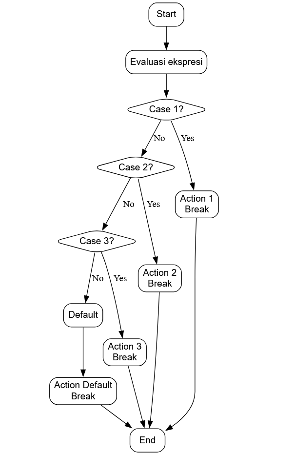

# 🧠 MODUL 11 — Switch Case

## 11.1 Paradigma Percabangan

Sebelumnya, kita telah mempelajari percabangan menggunakan if-else, yaitu struktur kontrol yang memungkinkan program memilih jalur eksekusi berdasarkan kondisi tertentu.

Sekarang, kita akan belajar switch-case, sebuah alternatif percabangan yang lebih efisien dan rapi ketika ada banyak kemungkinan nilai yang harus dicek.

**Apa itu Switch Case?**

switch-case adalah struktur kontrol dalam pemrograman yang memungkinkan eksekusi blok kode yang berbeda berdasarkan nilai suatu variabel atau ekspresi.

Dengan menggunakan switch-case:

- Kode menjadi lebih mudah dibaca dan dikelola dibandingkan menggunakan banyak if-else.

- Eksekusi bisa lebih efisien, terutama jika nilai yang dibandingkan berupa integer atau enum yang kontinu (compiler bisa membuat jump table).

**Struktur Umum Switch Case**

```go
switch (ekspresi) {
    case nilai1:
        // blok kode dijalankan jika ekspresi == nilai1
        break;
    case nilai2:
        // blok kode dijalankan jika ekspresi == nilai2
        break;
    ...
    default:
        // blok kode dijalankan jika tidak ada case yang cocok
}
```

#### Penjelasan:

- switch (ekspresi) → mengevaluasi nilai dari ekspresi yang diberikan.

- case nilai: → menentukan blok kode yang dijalankan jika nilai cocok.

- break; → menghentikan eksekusi switch setelah menemukan case yang sesuai. Tanpa break, program akan “fall through”, menjalankan semua case di bawahnya.

- default: → opsional, dijalankan jika tidak ada case yang cocok.

```go
int hari = 3;

switch (hari) {
    case 1:
        printf("Senin\n");
        break;
    case 2:
        printf("Selasa\n");
        break;
    case 3:
        printf("Rabu\n");
        break;
    default:
        printf("Hari tidak valid\n");
}
```

**Output:**

```nginx
Rabu
```

Penjelasan:

- Variabel hari bernilai 3.

- switch memeriksa setiap case.

- Case 3 cocok → menjalankan printf("Rabu").

- break menghentikan eksekusi agar tidak lanjut ke default.

#### Flowchart Switch-Case

Berikut representasi alur eksekusi switch-case:


**Penjelasan Flowchart:**

- Start → Evaluasi ekspresi yang ingin dicek.

- Case 1 → Case n → Dicek satu per satu dari atas.

- Jika cocok → Jalankan aksi, kemudian break ke End.

- Jika tidak cocok dengan semua case → Jalankan default (jika ada).

- End → Mengakhiri eksekusi switch.

Kelebihan Switch Case Dibanding If-Else

1. Lebih mudah dibaca
   Cocok untuk banyak kondisi dengan nilai tetap, sehingga kode lebih rapi daripada menulis banyak if-else.

2. Eksekusi lebih cepat
   Untuk tipe data tertentu (misal integer), compiler bisa membuat jump table, sehingga pencarian case cocok menjadi O(1).

3. Mengurangi kemungkinan kesalahan
   Dengan struktur yang jelas, lebih mudah melihat semua kemungkinan nilai yang ditangani.

## 11.2 Contoh Soal

**Soal 1 — Konversi Jam 24 Jam ke 12 Jam**

**Deskripsi:**

Buat algoritma untuk mengubah waktu dari format 24 jam menjadi format 12 jam.

**Masukan:** satu bilangan bulat dari 0 s.d. 23.

**Keluaran:** teks yang menyatakan jam dalam format 12 jam beserta AM/PM.

Contoh Masukan dan Keluaran:
| No | Masukan | Keluaran |
| -- | ------- | -------- |
| 1 | 13 | 1 PM |
| 2 | 0 | 12 AM |
| 3 | 12 | 12 PM |

**Jawaban:**

```go
package main

import "fmt"

func main() {
    var jam24 int
    var jam12 int
    var label string

    fmt.Print("Masukkan jam (0-23): ")
    fmt.Scan(&jam24)

    switch {
    case jam24 == 0:
        jam12 = 12
        label = "AM"
    case jam24 < 12:
        jam12 = jam24
        label = "AM"
    case jam24 == 12:
        jam12 = 12
        label = "PM"
    case jam24 > 12:
        jam12 = jam24 - 12
        label = "PM"
    }

    fmt.Println(jam12, label)
}
```

Output:

```java
Masukkan jam (0-23): 13
1 PM
Masukkan jam (0-23): 0
12 AM
Masukkan jam (0-23): 12
12 PM
```

**Soal 2 — Tanaman Karnivora**

**Deskripsi:**

Buat program untuk menentukan apakah sebuah tanaman termasuk karnivora dan apakah asli Indonesia.

**Masukan:** satu string (nama tanaman).

**Keluaran:**

- "Termasuk Tanaman Karnivora" atau "Tidak termasuk Tanaman Karnivora"

- Jika karnivora, lanjutkan dengan "Asli Indonesia" atau "Tidak Asli Indonesia"

**Contoh Masukan dan Keluaran:**

| No  | Masukan   | Keluaran                                             |
| --- | --------- | ---------------------------------------------------- |
| 1   | nepenthes | Termasuk Tanaman Karnivora <br> Asli Indonesia       |
| 2   | venus     | Termasuk Tanaman Karnivora <br> Tidak Asli Indonesia |
| 3   | karedok   | Tidak termasuk Tanaman Karnivora                     |

**Jawaban:**

```go
package main

import "fmt"

func main() {
    var nama_tanaman string

    fmt.Print("Masukkan nama tanaman: ")
    fmt.Scan(&nama_tanaman)

    switch nama_tanaman {
    case "nepenthes", "drosera":
        fmt.Println("Termasuk Tanaman Karnivora.")
        fmt.Println("Asli Indonesia.")
    case "venus", "sarracenia":
        fmt.Println("Termasuk Tanaman Karnivora.")
        fmt.Println("Tidak Asli Indonesia.")
    default:
        fmt.Println("Tidak termasuk Tanaman Karnivora.")
    }
}
```

**Output:**

```yaml
Masukkan nama tanaman: nepenthes
Termasuk Tanaman Karnivora.
Asli Indonesia.

Masukkan nama tanaman: venus
Termasuk Tanaman Karnivora.
Tidak Asli Indonesia.

Masukkan nama tanaman: karedok
Tidak termasuk Tanaman Karnivora.
```
