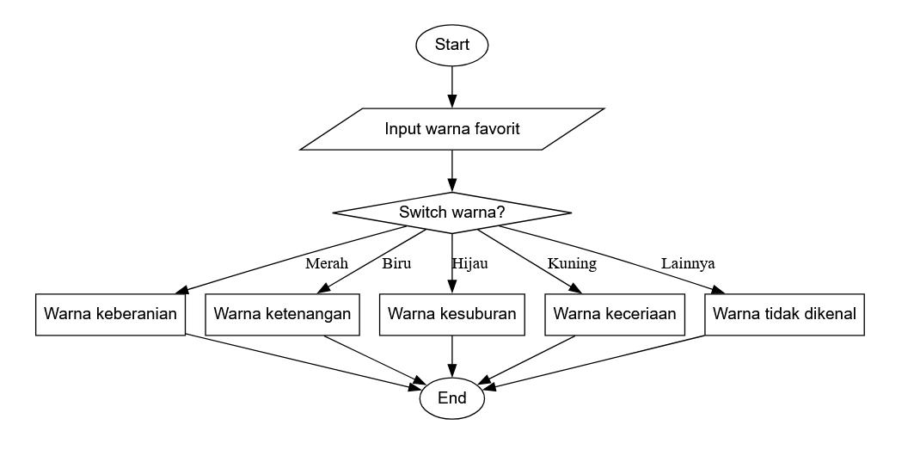

## 🧩 Soal Latihan Modul 11

### 🔹 1. Sistem Konversi Mata Uang + Pajak + Diskon

**Deskripsi:**

Buat program untuk menghitung **total harga** setelah **konversi mata uang, pajak,** dan **diskon khusus.**

**Masukan:**

1. Harga dasar (float)

2. Mata uang tujuan: "USD", "EUR", "JPY", "IDR"

3. Kategori pelanggan: "Regular", "Member", "VIP"

**Aturan:**

- Pajak: 10% untuk Regular, 5% untuk Member, 0% untuk VIP

- Diskon:

1. USD → 5% jika harga > 1000

2. EUR → 7% jika harga > 900

3. JPY → 3% jika harga > 120000

4. IDR → 2% jika harga > 10000000

**Keluaran:** Total harga dalam mata uang tujuan, ditampilkan dengan format: 1234.56 USD

| Harga  | Mata Uang | Pelanggan | Keluaran   |
| ------ | --------- | --------- | ---------- |
| 1500   | USD       | Member    | 1425 USD   |
| 2000   | EUR       | Regular   | 1930 EUR   |
| 150000 | JPY       | VIP       | 145500 JPY |

**Catatan:**

- Mengharuskan nested switch-case: pertama switch untuk mata uang, kedua untuk kategori pelanggan.
- Harus menghitung pajak + diskon sesuai aturan.

### 🔹 2. Penentuan Tarif Parkir

Buat program untuk menghitung tarif parkir kendaraan berdasarkan jenis kendaraan dan durasi parkir.

**Masukan:**

1. Jenis kendaraan: "Mobil", "Motor", "Truk"

2. Durasi parkir (jam, integer ≥ 0)

**Aturan tarif:**

- Mobil: 0–2 jam → 5000/jam, >2 jam → 4000/jam

- Motor: 0–3 jam → 2000/jam, >3 jam → 1500/jam

- Truk: 0–1 jam → 10000/jam, >1 jam → 8000/jam

**Diskon tambahan:**

Jika parkir > 8 jam → diskon 10% untuk semua jenis

**Keluaran:** Total biaya parkir

**Contoh Masukan/Keluaran:**

| Kendaraan | Durasi | Keluaran |
| --------- | ------ | -------- |
| Mobil     | 1      | 5000     |
| Motor     | 5      | 6500     |
| Truk      | 10     | 72000    |

**Catatan:**

- Soal menuntut nested switch: switch pertama untuk jenis kendaraan, switch kedua untuk durasi.
- Diskon >8 jam harus diperhitungkan setelah tarif dasar.

### 🔹 3. Penentu Warna Favorit

Buat program berdasar flowchart berikut:

