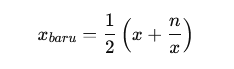
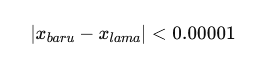

## Soal 1 — Validasi Input & Rata-rata Dinamis

**(Medium–Hard | I/O + do-while-loop + validasi)**

**Deskripsi**

Buat program Go yang membaca bilangan bulat satu per satu hingga pengguna memasukkan -1.
Program hanya menghitung bilangan positif (>0) dan mengabaikan bilangan negatif (selain -1 sebagai sentinel).

Setelah loop berhenti, tampilkan:

1. Jumlah bilangan valid

2. Rata-rata bilangan valid (2 angka di belakang koma)

**Aturan**

- Gunakan do-while-loop

- Lakukan validasi input

- Jika tidak ada bilangan valid, tampilkan 0 0.00

**Contoh Input**

```diff
5
-3
10
0
7
-1
```

**Contoh Output**

```diff
3 7.33

```

## Soal 2 — Simulasi Saldo & Loop Bersyarat

**(Hard | I/O + do-while-loop + logika kondisi)**

**Deskripsi**

Sebuah rekening memiliki saldo awal S.
Setiap input berikutnya merupakan transaksi:

- Positif → setoran

- Negatif → penarikan

Program terus menerima transaksi selama saldo tidak negatif.
Jika saldo menjadi negatif, program berhenti dan mencetak:

- Saldo terakhir sebelum minus

- Jumlah transaksi yang berhasil diproses

**Aturan**

- Saldo awal diinput pertama

- Gunakan while-loop

- Transaksi yang membuat saldo negatif tidak dihitung

**Contoh Input**

```diff
1000
200
-300
-800
50
```

**Proses**

Saldo menjadi 100 saat transaksi -800 → berhenti

**Contoh Output**

```diff
900 2
```

## Soal 3 — Aproksimasi Akar Kuadrat (Formula Matematis)

**(Hard | do-while-loop + numerik + matematika)**

**Deskripsi**
Buat program Go yang menghitung akar kuadrat dari bilangan positif n menggunakan metode Newton-Raphson.

Rumus Iterasi



Iterasi dihentikan ketika:



**Aturan**

- Input: bilangan real n

- Gunakan do-while-loop

- Jangan gunakan math.Sqrt()

- Output dibulatkan ke 5 angka desimal

**Contoh Input**

```diff
10
```

**Contoh Output**

```diff
3.16228

```
